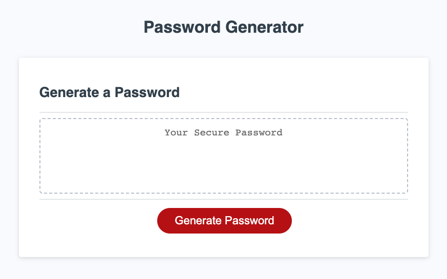
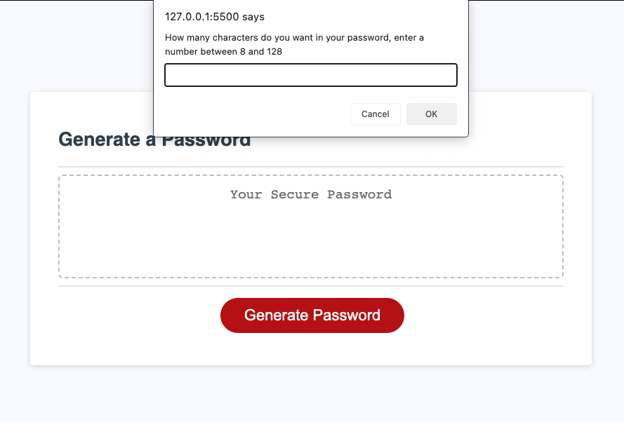
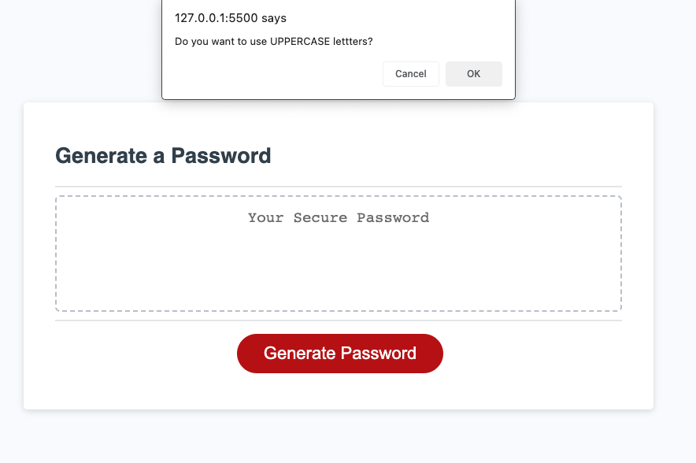
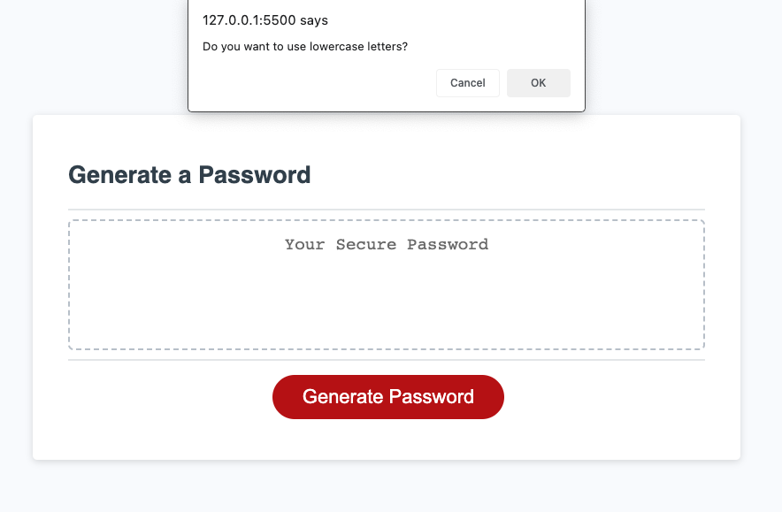
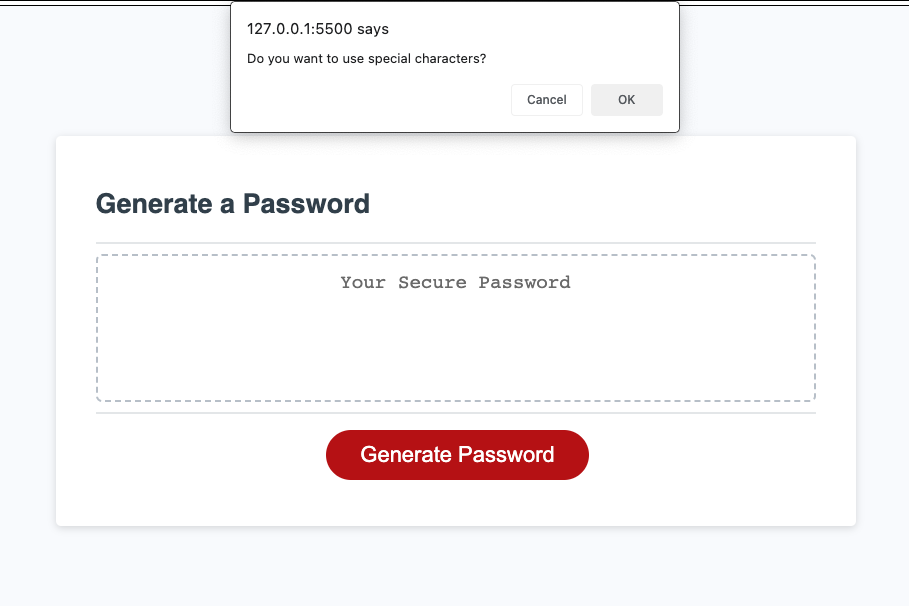
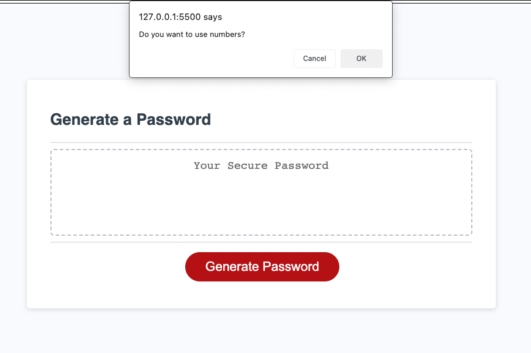
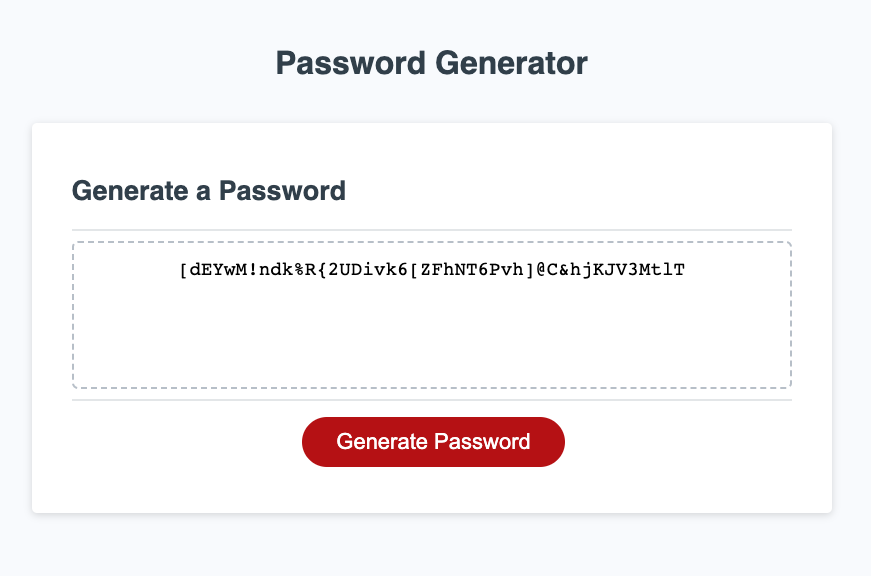

# Challenge 3  -- Password Generator

# Objective 
Create a password generator that will create passwords based on user inputs.
User chooses a password length between 8 and 128 characters.
User can choose to use numbers, lowercase letters, uppercase letters or special characters in the password. User must use at least one type of character and as many as four types.  
Password Generator was developed using JavaScript.  

  

# Links
### GitHub Repository 
### Deployment   
  

# Screenshots
#### Initial Page

  
#### Length Prompt

  
#### Uppercase Prompt

  
#### Lowercase Prompt

  
#### Special Character Prompt

  
#### Numbers Prompt

  
#### Password Generated

